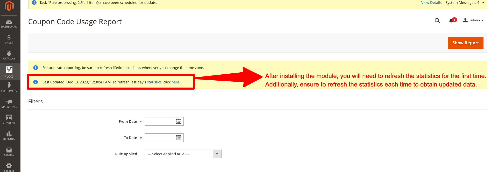
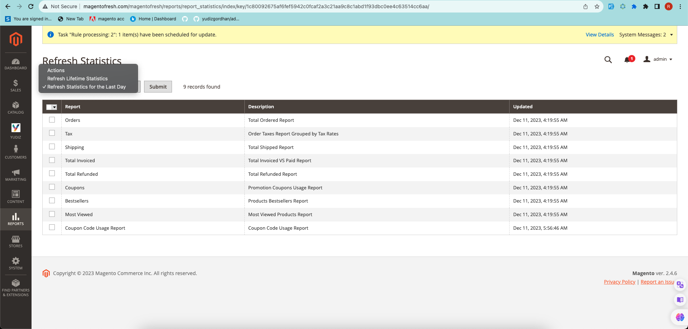
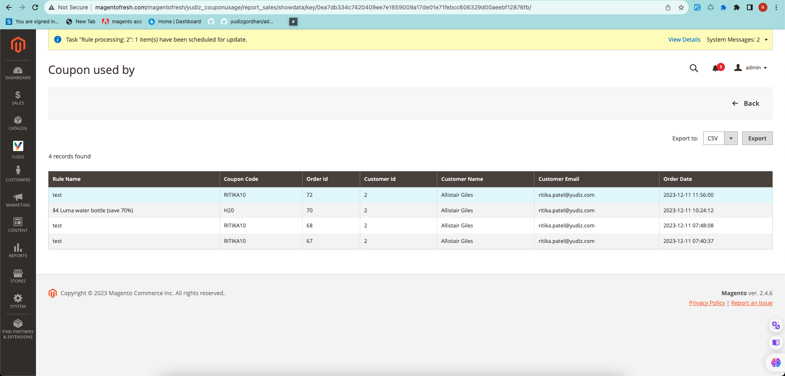

# Coupon Usage Report Extension for Magento 2
The Coupon Usage Report module in Magento 2 helps create reports showing how many people used a specific coupon code. It also generates an Excel sheet with user details linked to the usage of those coupons.

## Installation

You can install the Yudiz Coupon Usage Report Extension using one of two methods:
 1. Via Composer 
 2. By downloading it directly from the available source.

### 1. Install via composer

Before installing the Yudiz Coupon Usage Report Extension, it is necessary to install the Yudiz Core module. You can obtain the Yudiz Core module by using the following code.

Run the following command:
```shell
composer require yudiz/module-core
```
Now, To install the Yudiz Coupon Usage Report Extension via Composer, follow these steps in   your Magento 2 root folder:

Run the following command:
```shell
composer require yudiz/couponusagereport
```
After a successful installation, execute the following commands:

```shell
php bin/magento setup:upgrade
php bin/magento setup:static-content:deploy -f
php bin/magento c:c
```

With these steps completed, you'll be ready to utilize the Yudiz OrderNotification Extension.

### 2. Download Directly

Before Downloading the Yudiz Coupon Usage Report Extension, it is necessary to have the Yudiz Core module. You can download the module directly from below link:

https://github.com/yudiz-ritikapatel/yudiz-core

Once the zip file is downloaded, extract its contents within the 'app/code/Yudiz/Core' directory.

Now, To install the Yudiz Coupon Usage Report Extension you can download the Extension from below link:

https://github.com/yudiz-ritikapatel/CouponUsageReport

After successfully downloading the module, follow these steps to install it:

1.Unzip the downloaded folder.

2.Place the unzipped extension folder into the following path:

```shell
project-root-directory/app/code/Yudiz/CouponUsageReport
```

Indeed, after placing the extension folder in the specified directory, follow these Magento commands to complete the installation:
```shell
php bin/magento setup:upgrade
php bin/magento setup:static-content:deploy -f
php bin/magento c:c
```

By following these 2 Ways you can easily obtain and install the module.  For detailed instructions on its usage, refer to the user guide within this document.


## Features 
- Admin can quickly view coupon code usage reports.
- Admin can easily download user information linked to coupon codes in Excel format.


## Magento 2 Coupon Usage Report User Guide

Login to the **Magento Admin**, navigate to `Yudiz -> Configure CouponUsageReport `.

<div>
    
</div><br/>

- Refresh statistics : Click on Statistics or click here link
- From Date:Choose the date from which you wish to gather data
- To Date: Select the date until which you want the data
- Rule Applied: Choose the specific rule to indicate which data you need

After click on Click on Statistics you will see the following format:

<div>
    
</div><br/>

You have the option to update the statistics as per your requirements by choosing from the following:
- Refresh Lifetime Statistics 
- Refresh Statistics for the Last Day.

After completing these steps, click on "Show Report," which will take you to the page showing coupon usage data.

And You'll see the coupon usage data in the following manner:

<div>
    
</div><br/>

You can easily view which users used which coupon codes here, and by using the Export button, you can download or export this data into an Excel file.


